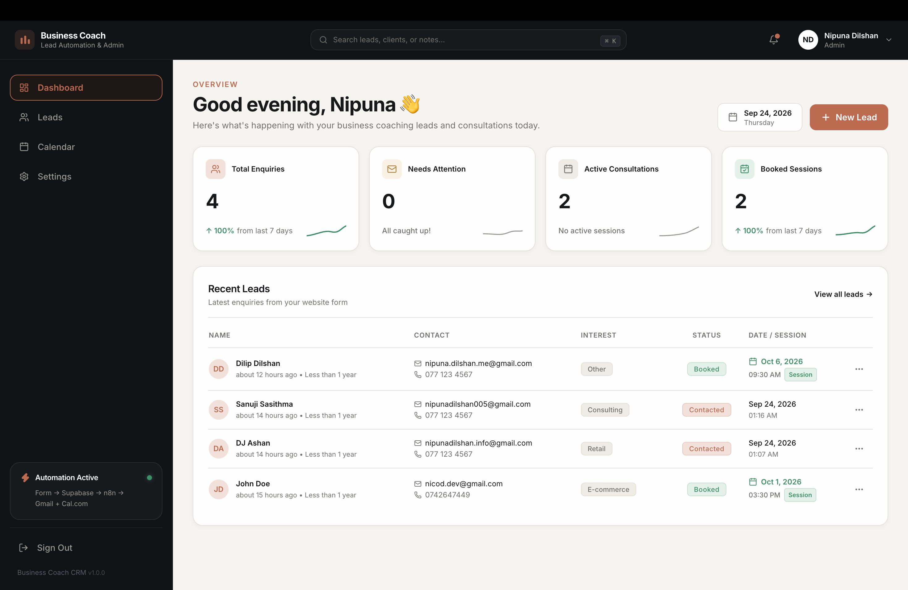
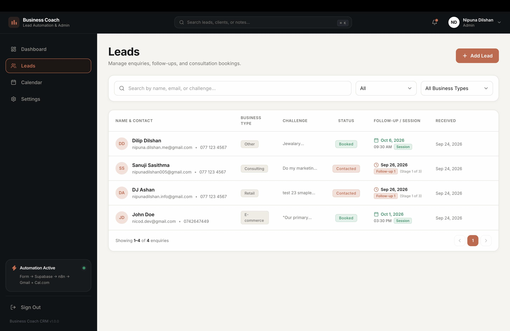
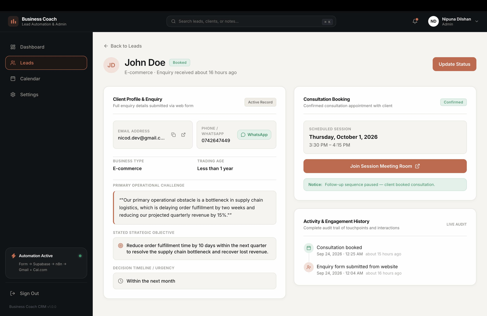
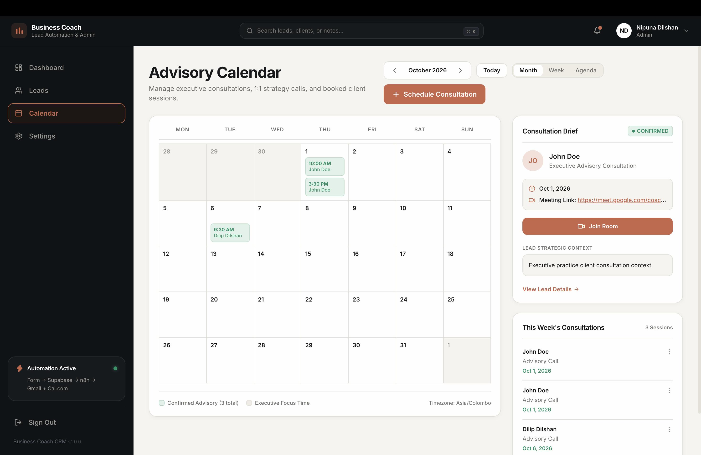
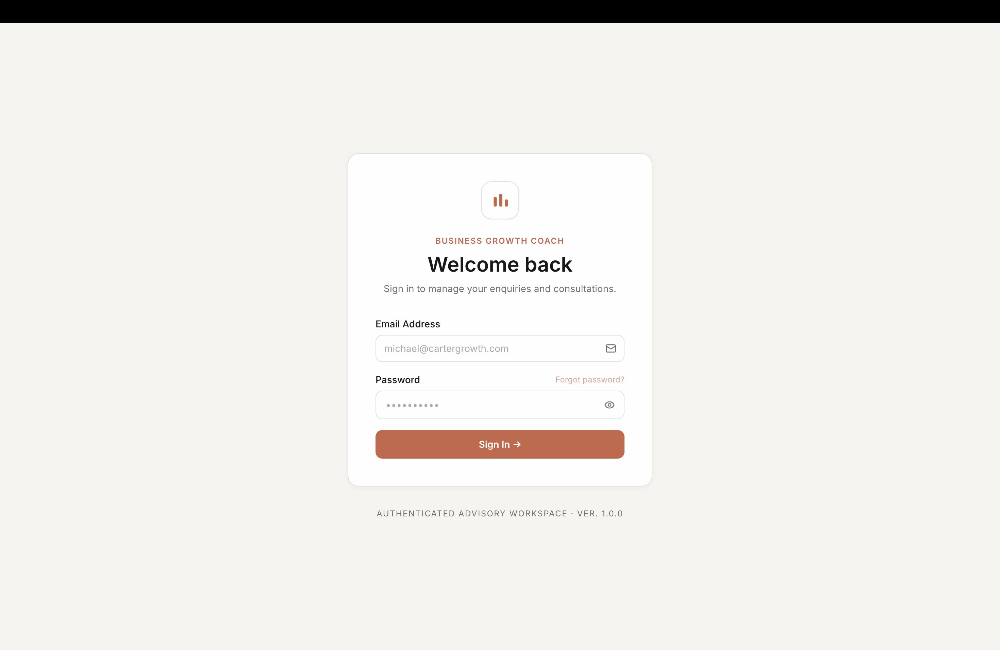
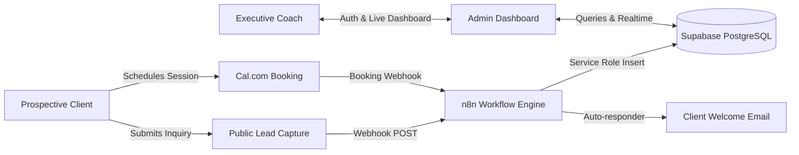

# 📈 Business Coach Lead & Follow-Up System

A modern, production-style Lead Management and Client Intake System built for business coaches and executive advisors. Features automated lead capture, n8n workflow integration, Supabase persistence, Cal.com consultation scheduling, and a bespoke editorial admin dashboard.

---

## 📸 Screenshots

| Admin Dashboard | Pipeline Management |
|:---:|:---:|
|  |  |

| Strategic Lead Dossier | Consultation Calendar |
|:---:|:---:|
|  |  |

| Secure Authentication |
|:---:|
|  |

---

## ⚡ Core Features

- **Executive Intake Form (`/`)**: public enquiry capture with client qualification.
- **Admin Dashboard (`/admin`)**: Real-time KPI metrics, active pipeline stages, actionable enquiry queue, and priority notes.
- **Lead Pipeline (`/admin/leads`)**: Client search, status filters (`New`, `Contacted`, `Booked`, `Archived`), and manual enquiry modal.
- **Client Dossier (`/admin/leads/:id`)**: Comprehensive view of client goals, challenges, follow-up history, and meeting logs.
- **Consultation Calendar (`/admin/calendar`)**: Month/Week/Agenda consultation views with meeting room links (`Google Meet`) and brief summaries.
- **Automated Workflows (n8n)**: Webhook-driven lead ingestion, email sequence triggers, and Cal.com booking sync.
- **Bespoke Design Language**: Warm editorial palette (Terracotta `#8C432D`, Cream `#FAF7F2`, DM Sans typography).

---

## 🛠️ Tech Stack

- **Frontend**: React 19, Vite, Tailwind CSS v3, React Router v6
- **Database & Auth**: Supabase (PostgreSQL, Row-Level Security, Auth)
- **Workflow Automation**: n8n (Webhooks, email sequences, CRM sync)
- **Scheduling**: Cal.com integration
- **Icons & Styling**: Lucide React, Google Fonts (`DM Sans`)

---

## 🔄 System Architecture



---

## 🚀 Quick Start

### 1. Clone & Install
```bash
git clone https://github.com/your-username/business-coach-lead-system.git
cd business-coach-lead-system
npm install
```

### 2. Environment Configuration
Create a `.env` file in the project root:
```bash
cp .env.example .env
```
Add your credentials:
```env
VITE_SUPABASE_URL=https://your-project.supabase.co
VITE_SUPABASE_ANON_KEY=your-supabase-anon-key
VITE_N8N_LEAD_WEBHOOK_URL=https://your-n8n-instance.com/webhook/lead-capture
VITE_CAL_BOOKING_URL=https://cal.com/your-cal-link
```

### 3. Run Locally
```bash
npm run dev
```
Open [http://localhost:5173](http://localhost:5173) for the public intake form or [http://localhost:5173/admin](http://localhost:5173/admin) for the advisory dashboard.

---

## 🗄️ Database Setup (Supabase)

In your **Supabase Dashboard → SQL Editor**, run:
1. `supabase/migrations/001_initial_schema.sql` (Creates `profiles`, `leads`, `lead_followups`, `consultations`, `email_events`)
2. `supabase/migrations/002_rls_policies.sql` (Configures Row Level Security)

---

## 📦 Build for Production

```bash
npm run build
```
Deploy the output `/dist` folder to Vercel, Netlify, or any static hosting platform.
