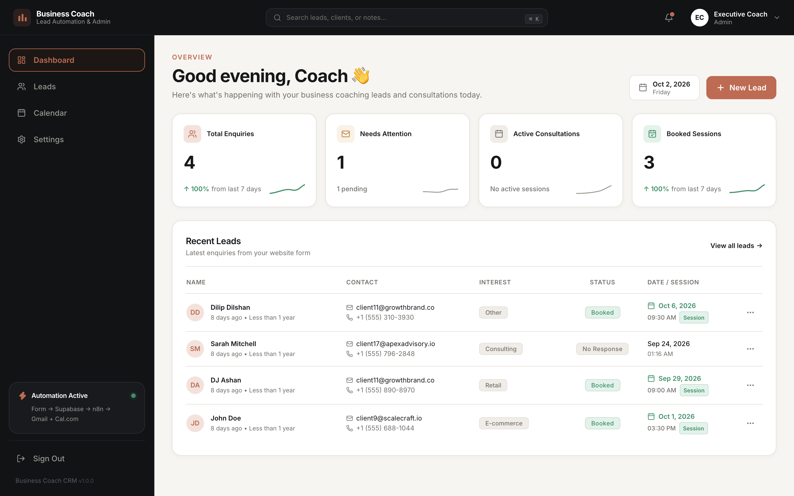
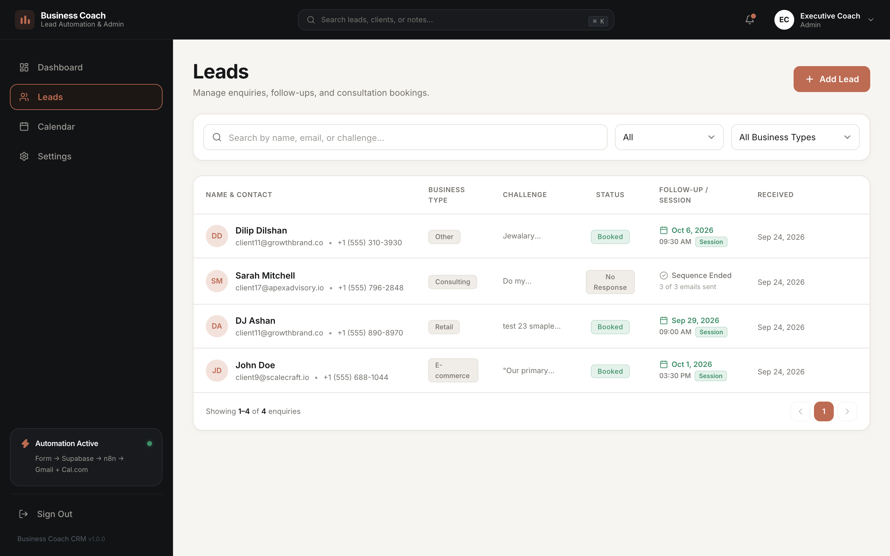
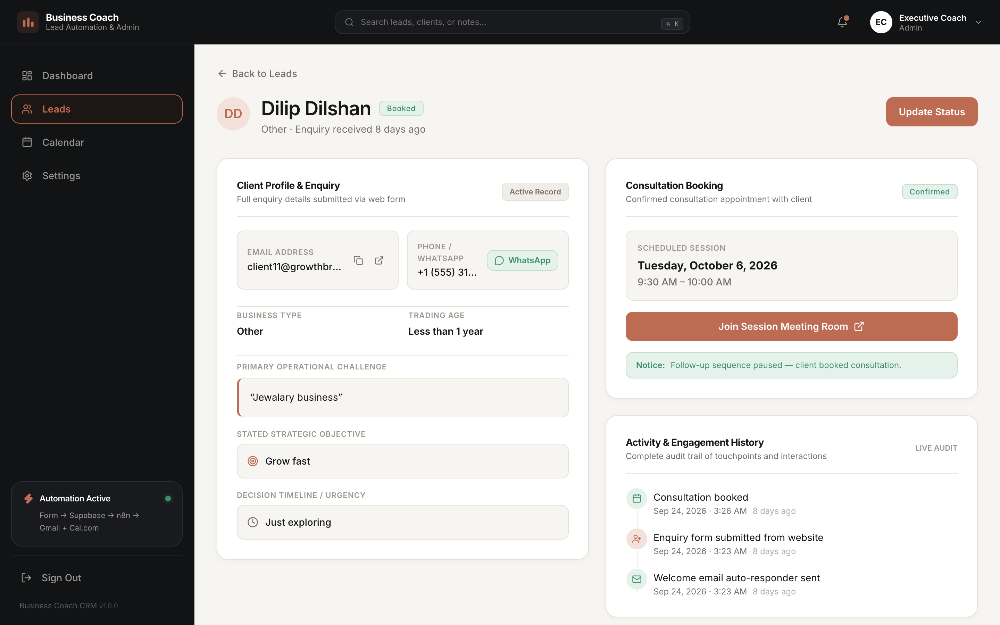
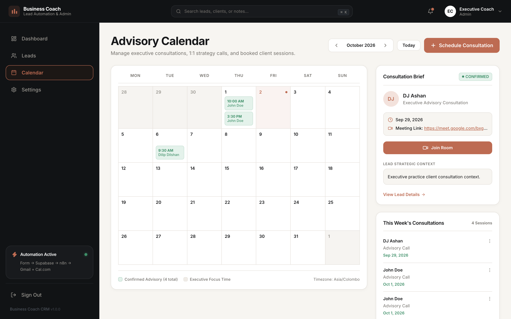
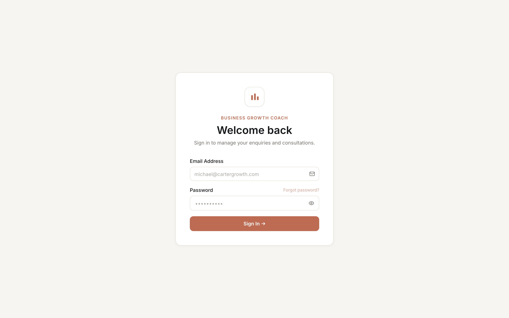
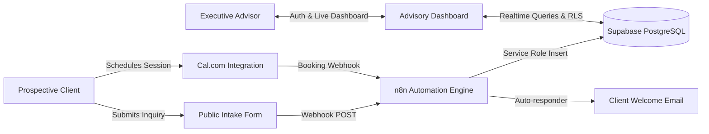

# 💼 Lead & Follow-Up Management System

An automated client intake, workflow orchestration, and follow-up CRM platform built for modern advisory, agency, and consulting practices.

[](https://react.dev/)
[](https://vitejs.dev/)
[](https://tailwindcss.com/)
[](https://supabase.com/)
[](https://n8n.io/)
[](LICENSE)

---

## ⚡ Engineering Highlights

- **Decoupled Workflow Automation**: Event-driven client intake powered by **n8n** webhooks, automated email responders, and **Cal.com** consultation syncing.
- **Client Lifecycle Pipeline**: Stage-gated lead tracking (`New` → `Contacted` → `Booked` → `Archived`) with real-time KPI metrics and priority queues.
- **Privacy-Preserving Demo Sandbox**: Deterministic in-memory data masking layer (`src/lib/demoMasking.js`) that anonymizes client emails, phone numbers, and identity for public demos without touching PostgreSQL records.
- **Enterprise-Grade Isolation**: Strict Supabase **Row-Level Security (RLS)** ensuring isolated multi-tenant data access.
- **Editorial Design System**: Bespoke, high-contrast palette (Terracotta `#8C432D`, Cream `#FAF7F2`, `DM Sans` typography) optimized for executive advisory workflows.

---

## 📸 System Overview

| Admin Dashboard | Lead Management |
|:---:|:---:|
|  |  |

| Lead Details & Meeting Logs | Consultation Calendar |
|:---:|:---:|
|  |  |

| Secure Authentication |
|:---:|
|  |

---

## 🔐 Demo Sandbox Credentials

To explore the live administrative workspace without modifying real production data, use the preconfigured demo account (or click **"Fill Demo Account Credentials"** directly on the login screen):

| Field | Credentials |
|:---|:---|
| **Login URL** | [`/login`](http://localhost:5173/login) |
| **Email** | `testuser@gmail.com` |
| **Password** | `TestUser@123` |
| **Quick Access** | 1-Click **"Fill Demo Account Credentials"** button on login screen |
| **Environment** | Automated Sandbox (Masked PII, Read-only integrations) |

---

## 🔄 System Architecture


```mermaid
graph LR
  Client[Prospective Client] -->|Submits Inquiry| Form[Public Intake Form]
  Form -->|Webhook POST| n8n[n8n Automation Engine]
  n8n -->|Service Role Insert| Supabase[(Supabase PostgreSQL)]
  n8n -->|Auto-responder| Email[Client Welcome Email]
  Client -->|Schedules Session| Cal[Cal.com Integration]
  Cal -->|Booking Webhook| n8n
  Admin[Executive Advisor] <-->|Auth & Live Dashboard| ReactApp[Advisory Dashboard]
  ReactApp <-->|Realtime Queries & RLS| Supabase
```

---

## 📁 Project Architecture

```
lead-followup-management-system/
├── public/                 # Static branding assets & favicon
├── screenshots/            # High-resolution documentation preview assets
├── scripts/                # Automated screenshot & maintenance tooling
├── src/
│   ├── app/                # App entrypoint, routing, and top-level providers
│   ├── components/         # Shared UI primitives, Topbar, and layout frames
│   ├── features/           # Feature-sliced modules
│   │   ├── auth/           # Authentication state, login flows, and session guards
│   │   ├── leads/          # Enquiry tables, details drawer, filters, and forms
│   │   └── settings/       # Integration webhooks, calendar syncing, and profile
│   ├── lib/                # Supabase client, n8n dispatchers, and demo masking
│   ├── pages/              # Primary route views (Dashboard, Leads, Calendar, etc.)
│   └── styles/             # Global styling rules and Tailwind base layer
└── supabase/
    └── migrations/         # PostgreSQL schema tables and RLS security policies
```

---

## 🚀 Quick Start

### 1. Clone & Install
```bash
git clone https://github.com/your-username/lead-followup-management-system.git
cd lead-followup-management-system
npm install
```

### 2. Environment Configuration
Create a `.env` file in the project root:
```bash
cp .env.example .env
```
Populate your credentials:
```env
VITE_SUPABASE_URL=https://your-project.supabase.co
VITE_SUPABASE_ANON_KEY=your-supabase-anon-key
VITE_N8N_LEAD_WEBHOOK_URL=https://your-n8n-instance.com/webhook/lead-capture
VITE_CAL_BOOKING_URL=https://cal.com/your-cal-link
```

### 3. Run Locally
```bash
npm run dev
```
* Public Client Form: [http://localhost:5173](http://localhost:5173)
* Advisory Dashboard: [http://localhost:5173/admin](http://localhost:5173/admin) (Log in via [`/login`](http://localhost:5173/login) using the 1-click demo button)

### 4. Database Setup (Supabase)
In your **Supabase Dashboard → SQL Editor**, run the migration files in sequence:
1. `supabase/migrations/001_initial_schema.sql` (Creates core schemas, tables, and indices)
2. `supabase/migrations/002_rls_policies.sql` (Enforces Row-Level Security policies)

---

## 📦 Production Build

```bash
npm run build
```
Generates an optimized bundle in `/dist` ready for immediate deployment to Vercel, Netlify, or AWS CloudFront.
